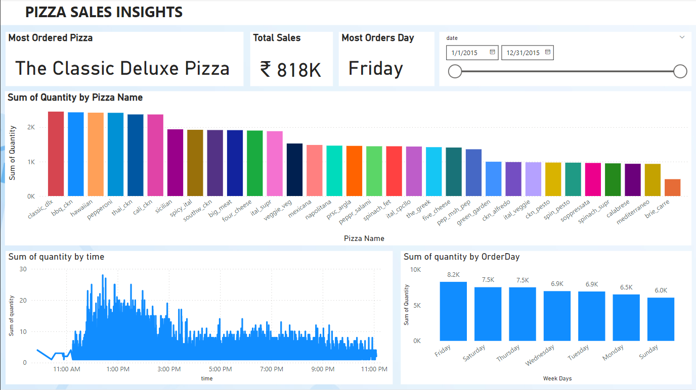
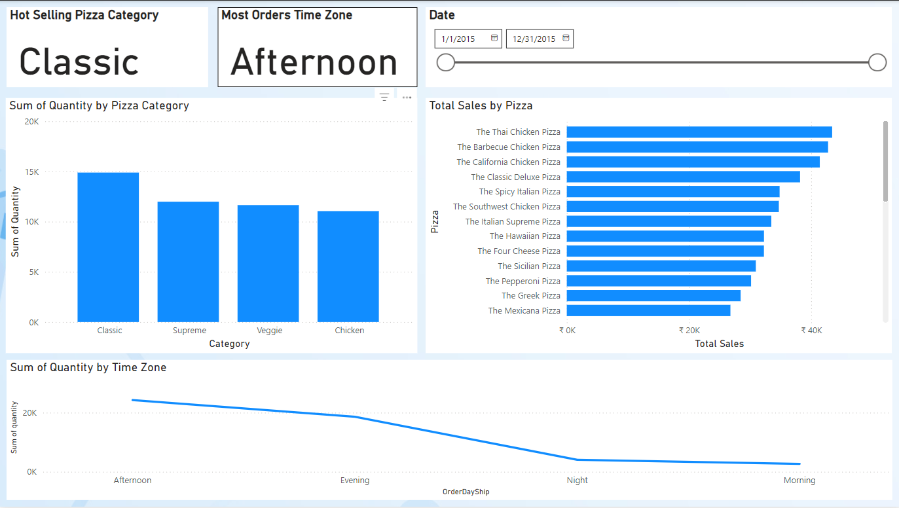

# Pizza Sales Insights Dashboard

## Overview
This repository showcases a Power BI dashboard for analyzing pizza sales data. The dashboard provides valuable insights into various aspects of the pizza business, such as most ordered pizzas, total sales, peak order times, and hot-selling pizza categories.

## Dataset
The dataset used includes the following tables:
- **OrderDetails**: Contains details about each order, including quantity and pizza IDs.
- **Orders**: Includes order-level data such as date and time.
- **Pizzas**: Maps pizza IDs to their respective pizza types.
- **PizzaTypes**: Categorizes pizzas into types and categories.

## Key Features
1. **Most Ordered Pizza**: Identifies the pizza with the highest number of orders.
2. **Total Sales**: Displays the overall revenue generated.
3. **Most Ordered Day**: Highlights the day of the week with the most orders.
4. **Date Slicer**: Allows filtering data by specific date ranges.
5. **Hot-Selling Pizza Category**: Shows the top-performing pizza categories based on sales.
6. **Most Orders by Time Zone**: Analyzes orders based on time zones such as morning, afternoon, evening, and night.

## Visualizations
To present these insights, the following charts and visuals were used:
- **Stacked Column Chart**: For displaying sales distribution.
- **Clustered Bar Chart**: To compare orders by categories and time zones.
- **Line Chart**: For visualizing trends over time.

## Screenshots
### Main Dashboard Views

## Tools & Technologies
- **Power BI**: For data modeling, analysis, and visualization.
- **DAX**: Used for creating calculated measures and columns.

## Learnings
This project helped enhance my skills in:
- Data integration and modeling across multiple tables.
- Creating interactive and intuitive dashboards using Power BI.
- Writing efficient DAX formulas to derive meaningful insights.

## Future Enhancements
- Include customer demographic analysis.
- Add predictive analytics for future sales trends.
- Enhance interactivity with more advanced slicers and filters.

## How to Use
1. Open the Power BI file (`Pizza_Sales_Insights.pbix`) using Power BI Desktop.
2. Explore the dashboard to gain insights into pizza sales data.
3. Customize the visuals or formulas as needed for your specific use case.

## Contact
Feel free to connect with me on [LinkedIn](https://www.linkedin.com/) or reach out for collaboration opportunities.

## License
This project is licensed under the MIT License - see the LICENSE file for details.
